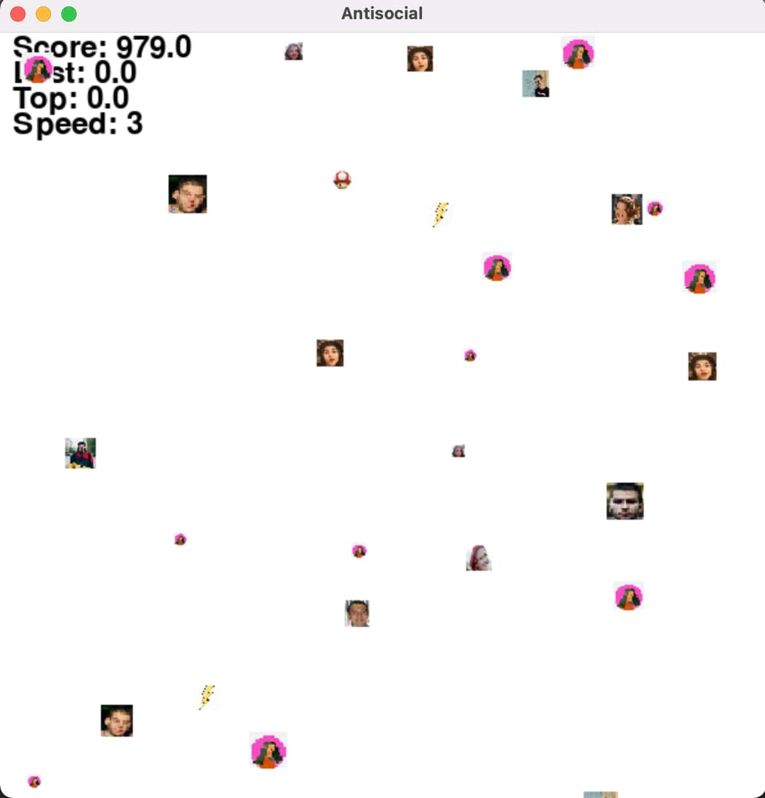

# Antisocial

A game where while I try to duck my friends I also have to collect powerups in the form of lightnings and mushrooms.

>

## Setup

Best would be to create a new environment with python version >=3.7.7.  

1. In the environment: `pip install -r requirements.txt` 
2. `python __init__.py` 

## Characters

main character
> <- me

good girl
> <- different points depending on the image size.

gang of bad brodies
>       

power ups
> <- randomly +1 or -1 speed
> <- +200 points

## Game Play

Controls:  
You can use the arrows or WASD.  
Use 'ESC' button to terminate the game.  
You can go through the walls.  
'X' - slows enemies, but it costs score tho.  
